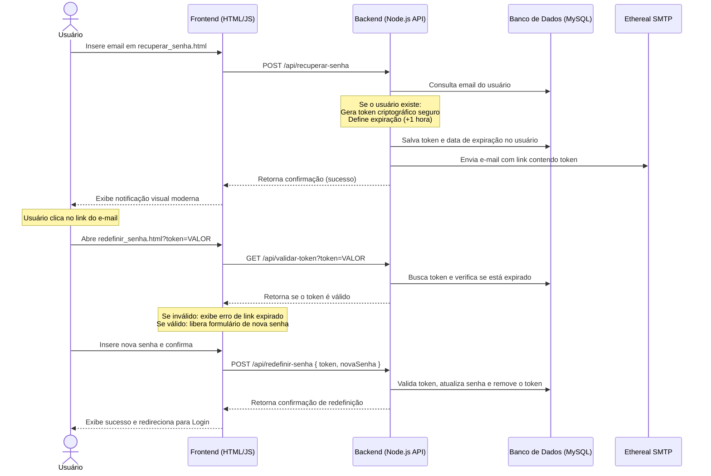

# Plano de Implementação: Recuperação e Redefinição de Senha Moderna

Este plano detalha as melhorias estéticas e funcionais para o fluxo de recuperação e redefinição de senha do **Sistema de Triagem Clínica**.

---

## Revisão do Usuário Requerida

> [!IMPORTANT]
> **Banco de Dados**: Para implementar o fluxo moderno baseado em tokens seguros com expiração, precisamos adicionar duas colunas à tabela `usuario` (`token_recuperacao` e `token_expiracao`). Faremos isso de forma automática na inicialização do servidor em [server.js](file:///c:/Users/gabri/OneDrive/Documentos/sistema_de_triagem4/server.js) para evitar que você precise rodar comandos manuais SQL.
>
> **Armazenamento de Senhas**: Atualmente, as senhas estão salvas em texto simples no banco. Para manter compatibilidade com o login existente, a redefinição de senha continuará salvando em texto simples. Caso no futuro queira migrar para hashes (como `bcrypt`), podemos planejar essa melhoria extra.
>
> **Simulação de E-mail**: Utilizaremos o **Nodemailer** integrado ao **Ethereal Email** no backend. O Ethereal gera caixas de correio de teste em tempo real. Quando você solicitar a recuperação de senha, o link de teste e a visualização do e-mail serão exibidos diretamente no console do seu servidor Node.js, permitindo que você clique, abra o e-mail no navegador e complete a redefinição de forma idêntica a um ambiente de produção real.

---

## Fluxo da Solução Moderna de Redefinição de Senha

O fluxo seguirá o padrão de segurança atual da indústria:

---

## Propostas de Alteração

### 1. Backend & Banco de Dados

#### [MODIFY] [server.js](file:///c:/Users/gabri/OneDrive/Documentos/sistema_de_triagem4/server.js)
* **Migração Automática**: Executar no startup um script para adicionar `token_recuperacao VARCHAR(255)` e `token_expiracao DATETIME` na tabela `usuario` se elas não existirem.
* **Configuração do Nodemailer**: Instalar `nodemailer` e configurar um transporter SMTP do **Ethereal** criado sob demanda ou parametrizável.
* **Novas Rotas**:
  * `POST /api/recuperar-senha`: Verifica e-mail, gera token hex via `crypto.randomBytes(32)`, armazena no BD com `DATE_ADD(NOW(), INTERVAL 1 HOUR)` e envia e-mail com layout HTML profissional contendo o link de redefinição.
  * `GET /api/validar-token`: Recebe o token via query param e retorna `{ valido: true }` ou `{ valido: false, mensagem }` se expirado/inexistente.
  * `POST /api/redefinir-senha`: Recebe `{ token, senha }`, valida se o token ainda é válido, atualiza a senha no banco, zera as colunas de token e retorna status.

---

### 2. Interface (Frontend & Design)

#### [MODIFY] [global.css](file:///c:/Users/gabri/OneDrive/Documentos/sistema_de_triagem4/styles/global.css)
* Atualizar a estética do container de recuperação para usar cores premium (Paleta HSL baseada em azul profissional e cinzas modernos).
* Criar componentes visuais modernos:
  * inputs com foco animado e sombra suave.
  * Botões interativos com micro-transições (`transform: translateY`).
  * Toast de sucesso flutuante moderno para avisos de e-mail enviado.
  * Medidor de força de senha para a tela de redefinição.

#### [MODIFY] [recuperar_senha.html](file:///c:/Users/gabri/OneDrive/Documentos/sistema_de_triagem4/pages/cadastro/recuperar_senha.html)
* Ajustar a estrutura HTML para usar tags semânticas.
* Substituir o link externo de imagem/ícone por um SVG embutido de chave/segurança moderno, eliminando a dependência do Flaticon.
* Linkar os elementos às novas classes de estilo.

#### [MODIFY] [recuperarSenha.js](file:///c:/Users/gabri/OneDrive/Documentos/sistema_de_triagem4/js/recuperarSenha.js)
* Atualizar a função para enviar uma requisição `fetch` de fato para `/api/recuperar-senha`.
* Adicionar estados de carregamento (desabilitar botão e mostrar spinner/carregando) durante o envio do e-mail.
* Exibir a mensagem de confirmação de envio de e-mail usando animações do CSS atualizado.

#### [NEW] [redefinir_senha.html](file:///c:/Users/gabri/OneDrive/Documentos/sistema_de_triagem4/pages/cadastro/redefinir_senha.html)
* **Nova Tela**: Tela de redefinição onde o usuário escolhe a nova senha.
* **Layout**: Mesmo estilo visual moderno e limpo da tela de recuperação de senha.
* **Funcionalidades**:
  * Validação visual de correspondência das senhas digitadas.
  * Força da senha (Fraca, Média, Forte) com feedback de cor.

#### [NEW] [redefinirSenha.js](file:///c:/Users/gabri/OneDrive/Documentos/sistema_de_triagem4/js/redefinirSenha.js)
* **Lógica**:
  * Ao carregar a página, lê o parâmetro `?token=...` da URL.
  * Envia requisição para `/api/validar-token` para verificar validade do link.
  * Se o token for inválido/expirado, desabilita o formulário e exibe tela de erro com link para solicitar nova recuperação.
  * Se for válido, permite o preenchimento.
  * No submit, envia a nova senha criptografada/limpa para `/api/redefinir-senha`. Em caso de sucesso, redireciona o usuário para a página de login após 3 segundos com um feedback visual amigável.

---

## Plano de Verificação

### Testes Manuais
1. **Verificação de Banco**: Rodar o servidor Node.js e constatar no terminal a criação automática das colunas `token_recuperacao` e `token_expiracao` na tabela `usuario`.
2. **Layout**: Acessar `pages/cadastro/recuperar_senha.html` e verificar se a estilização de input, botões e SVG está harmoniosa e responsiva.
3. **Fluxo de Recuperação**:
   * Digitar um email válido cadastrado no banco.
   * Clicar no botão "Enviar Link de Recuperação".
   * Verificar se o console do Node.js exibe o e-mail simulado com o link da Ethereal Email.
   * Clicar no link de visualização do Ethereal para inspecionar o layout do e-mail recebido.
4. **Fluxo de Redefinição**:
   * Clicar no link de redefinição contido no e-mail simulação.
   * Garantir que abre a página `redefinir_senha.html?token=...` validando o token.
   * Tentar submeter uma senha inválida (menor que 6 caracteres ou não coincidente) e verificar validações.
   * Redefinir a senha com sucesso, verificar o redirecionamento automático para a página de login.
   * Fazer login no sistema usando a nova senha e garantir que o acesso funciona perfeitamente.
